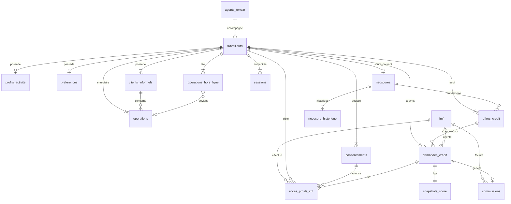

# TeriyaScore — Conception de la base de données

| | |
|---|---|
| **Document** | Database Design |
| **SGBD cible** | PostgreSQL 16+ |
| **Sources** | `domain-model.md`, `software-architecture.md`, UML classes corrigées |
| **Mapping** | HER-01b — une table `operations` (pas d’héritage) |
| **Version** | 1.0 |
| **Date** | Juillet 2026 |

> Document de **conception** (tables, colonnes, clés, index, contraintes).  
> Ne constitue pas encore un script de migration exécutable.

---

## 1. Conventions

| Convention | Choix |
|------------|--------|
| Nommage tables | `snake_case`, pluriel |
| Nommage colonnes | `snake_case` |
| Clés primaires | `id UUID` (généré côté app ou `gen_random_uuid()`) |
| Horodatage | `TIMESTAMPTZ` (UTC) |
| Montants | `INTEGER` (FCFA entiers) |
| Booléens | `BOOLEAN NOT NULL` + défaut explicite |
| Soft delete | Non au MVP (sauf mention contraire) |
| Schéma | `public` (MVP) ; schemas métier possibles plus tard (`identity`, `ledger`…) |

### Types énumérés PostgreSQL

```text
statut_compte, type_operation, nature_stock, statut_creance, statut_sync,
etat_operation_hors_ligne, type_consentement, usage_credit, modalite_remboursement,
statut_demande_credit, segment_neoscore, statut_partenariat, niveau_acces_imf,
statut_compte_bancaire, statut_commission, statut_session
```

---

## 2. Diagramme relationnel (vue d’ensemble)



---

## 3. Catalogue des tables

---

### 3.1 `agents_terrain`

**Rôle** : Agent d’accompagnement pilote (UC20).

| Colonne | Type | Null | Défaut | Description |
|---------|------|------|--------|-------------|
| `id` | `UUID` | NON | | **PK** |
| `nom` | `VARCHAR(120)` | NON | | Identité |
| `zone_intervention` | `VARCHAR(120)` | NON | | Ex. Ouagadougou |
| `actif` | `BOOLEAN` | NON | `TRUE` | En mission |
| `created_at` | `TIMESTAMPTZ` | NON | `now()` | |
| `updated_at` | `TIMESTAMPTZ` | NON | `now()` | |

**PK** : `id`  
**FK** : aucune  
**Index** : `idx_agents_terrain_actif` (`actif`) WHERE `actif = TRUE`  
**Contraintes** : `nom` longueur > 0 (CHECK)

---

### 3.2 `travailleurs`

**Rôle** : TravailleurInformel — identité & compte.

| Colonne | Type | Null | Défaut | Description |
|---------|------|------|--------|-------------|
| `id` | `UUID` | NON | | **PK** |
| `telephone` | `VARCHAR(20)` | NON | | Identité unique (+226…) |
| `pin_hash` | `VARCHAR(255)` | NON | | Secret PIN hashé |
| `nom_affiche` | `VARCHAR(120)` | NON | `''` | |
| `genre` | `VARCHAR(20)` | OUI | | Optionnel (indicateurs inclusion) |
| `statut_compte` | `statut_compte` | NON | `'brouillon'` | brouillon \| actif \| suspendu |
| `onboarding_termine` | `BOOLEAN` | NON | `FALSE` | |
| `agent_terrain_id` | `UUID` | OUI | | Accompagnement |
| `date_derniere_connexion` | `TIMESTAMPTZ` | OUI | | |
| `created_at` | `TIMESTAMPTZ` | NON | `now()` | |
| `updated_at` | `TIMESTAMPTZ` | NON | `now()` | |

**PK** : `id`  
**FK** :
- `agent_terrain_id` → `agents_terrain(id)` ON DELETE SET NULL

**Index** :
- `uq_travailleurs_telephone` **UNIQUE** (`telephone`)
- `idx_travailleurs_statut` (`statut_compte`)
- `idx_travailleurs_agent` (`agent_terrain_id`) WHERE `agent_terrain_id IS NOT NULL`

**Contraintes** :
- `CHK_travailleurs_telephone_non_vide` : `length(trim(telephone)) > 0`
- `CHK_travailleurs_pin_hash_non_vide` : `length(pin_hash) > 0`

---

### 3.3 `profils_activite`

**Rôle** : ProfilActivite (1—0..1).

| Colonne | Type | Null | Défaut | Description |
|---------|------|------|--------|-------------|
| `id` | `UUID` | NON | | **PK** |
| `travailleur_id` | `UUID` | NON | | **FK** unique |
| `metier` | `VARCHAR(40)` | OUI | | |
| `anciennete_activite` | `VARCHAR(20)` | OUI | | Tranche ordinale |
| `ca_journalier_estime` | `VARCHAR(20)` | OUI | | Tranche ordinale |
| `participation_tontine` | `BOOLEAN` | OUI | | |
| `cotisation_tontine` | `INTEGER` | OUI | | FCFA |
| `usage_mobile_money` | `VARCHAR(20)` | OUI | | |
| `statut_compte_bancaire` | `statut_compte_bancaire` | OUI | | |
| `ville` | `VARCHAR(80)` | OUI | | |
| `zone` | `VARCHAR(80)` | OUI | | |
| `created_at` | `TIMESTAMPTZ` | NON | `now()` | |
| `updated_at` | `TIMESTAMPTZ` | NON | `now()` | |

**PK** : `id`  
**FK** : `travailleur_id` → `travailleurs(id)` ON DELETE CASCADE  
**Index** : `uq_profils_activite_travailleur` **UNIQUE** (`travailleur_id`)  
**Contraintes** :
- `CHK_profils_cotisation` : `cotisation_tontine IS NULL OR cotisation_tontine >= 0`

---

### 3.4 `preferences`

**Rôle** : PreferencesUtilisateur (1—0..1).

| Colonne | Type | Null | Défaut | Description |
|---------|------|------|--------|-------------|
| `id` | `UUID` | NON | | **PK** |
| `travailleur_id` | `UUID` | NON | | **FK** unique |
| `langue` | `VARCHAR(10)` | NON | `'fr'` | fr, mr, dl, ff… |
| `mode_iconographique` | `BOOLEAN` | NON | `FALSE` | |
| `assistance_vocale_active` | `BOOLEAN` | NON | `FALSE` | |
| `fuseau` | `VARCHAR(64)` | NON | `'Africa/Ouagadougou'` | |
| `updated_at` | `TIMESTAMPTZ` | NON | `now()` | |

**PK** : `id`  
**FK** : `travailleur_id` → `travailleurs(id)` ON DELETE CASCADE  
**Index** : `uq_preferences_travailleur` **UNIQUE** (`travailleur_id`)

---

### 3.5 `consentements`

**Rôle** : Consentement versionné.

| Colonne | Type | Null | Défaut | Description |
|---------|------|------|--------|-------------|
| `id` | `UUID` | NON | | **PK** |
| `travailleur_id` | `UUID` | NON | | **FK** |
| `type` | `type_consentement` | NON | | anonymisation_recherche \| partage_imf \| marketing_partenaires |
| `accorde` | `BOOLEAN` | NON | `FALSE` | |
| `date_decision` | `TIMESTAMPTZ` | NON | `now()` | |
| `version_politique` | `VARCHAR(40)` | NON | | |
| `retractable` | `BOOLEAN` | NON | `TRUE` | |
| `created_at` | `TIMESTAMPTZ` | NON | `now()` | |
| `updated_at` | `TIMESTAMPTZ` | NON | `now()` | |

**PK** : `id`  
**FK** : `travailleur_id` → `travailleurs(id)` ON DELETE CASCADE  
**Index** :
- `uq_consentements_travailleur_type` **UNIQUE** (`travailleur_id`, `type`)
- `idx_consentements_partage` (`type`, `accorde`) WHERE `type = 'partage_imf' AND accorde = TRUE`

---

### 3.6 `clients_informels`

**Rôle** : Client du travailleur (créances).

| Colonne | Type | Null | Défaut | Description |
|---------|------|------|--------|-------------|
| `id` | `UUID` | NON | | **PK** |
| `travailleur_id` | `UUID` | NON | | **FK** propriétaire |
| `nom` | `VARCHAR(120)` | NON | | Obligatoire |
| `telephone` | `VARCHAR(20)` | OUI | | Relance |
| `note` | `VARCHAR(500)` | OUI | | |
| `created_at` | `TIMESTAMPTZ` | NON | `now()` | |
| `updated_at` | `TIMESTAMPTZ` | NON | `now()` | |

**PK** : `id`  
**FK** : `travailleur_id` → `travailleurs(id)` ON DELETE CASCADE  
**Index** :
- `idx_clients_travailleur` (`travailleur_id`)
- `idx_clients_travailleur_nom` (`travailleur_id`, `nom`)

**Contraintes** : `CHK_clients_nom` : `length(trim(nom)) > 0`

---

### 3.7 `operations`

**Rôle** : Cahier numérique (vente / stock / dépense / créance).

| Colonne | Type | Null | Défaut | Description |
|---------|------|------|--------|-------------|
| `id` | `UUID` | NON | | **PK** |
| `travailleur_id` | `UUID` | NON | | **FK** |
| `type` | `type_operation` | NON | | vente \| stock \| depense \| creance |
| `montant_fcfa` | `INTEGER` | NON | | > 0 |
| `libelle` | `VARCHAR(200)` | OUI | | |
| `date_operation` | `TIMESTAMPTZ` | NON | | Moment métier |
| `statut_sync` | `statut_sync` | NON | `'synchronisee'` | locale \| synchronisee \| en_conflit |
| `identifiant_idempotence` | `UUID` | OUI | | Anti-doublon sync |
| `client_id` | `UUID` | OUI | | **FK** si créance |
| `nature_stock` | `nature_stock` | OUI | | entree \| sortie |
| `categorie_depense` | `VARCHAR(80)` | OUI | | |
| `echeance` | `TIMESTAMPTZ` | OUI | | Créance |
| `date_reglement` | `TIMESTAMPTZ` | OUI | | Créance réglée |
| `statut_creance` | `statut_creance` | OUI | | ouverte \| en_retard \| reglee \| annulee |
| `created_at` | `TIMESTAMPTZ` | NON | `now()` | |
| `updated_at` | `TIMESTAMPTZ` | NON | `now()` | |

**PK** : `id`  
**FK** :
- `travailleur_id` → `travailleurs(id)` ON DELETE CASCADE  
- `client_id` → `clients_informels(id)` ON DELETE RESTRICT  

**Index** :
- `uq_operations_idempotence` **UNIQUE** (`identifiant_idempotence`) WHERE `identifiant_idempotence IS NOT NULL`
- `idx_operations_travailleur_date` (`travailleur_id`, `date_operation` DESC)
- `idx_operations_travailleur_type` (`travailleur_id`, `type`)
- `idx_operations_client` (`client_id`) WHERE `client_id IS NOT NULL`
- `idx_operations_creances_ouvertes` (`travailleur_id`, `echeance`) WHERE `type = 'creance' AND statut_creance IN ('ouverte', 'en_retard')`

**Contraintes CHECK** :
- `CHK_operations_montant_positif` : `montant_fcfa > 0`
- `CHK_operations_creance_coherente` :  
  `(type <> 'creance') OR (client_id IS NOT NULL AND statut_creance IS NOT NULL)`
- `CHK_operations_stock_coherent` :  
  `(type <> 'stock') OR (nature_stock IS NOT NULL)`
- `CHK_operations_client_scope` : (recommandé via trigger) le `client_id` appartient au même `travailleur_id`
- `CHK_operations_reglement` :  
  `(date_reglement IS NULL) OR (statut_creance = 'reglee')`

---

### 3.8 `operations_hors_ligne`

**Rôle** : File d’intentions offline (sync).

| Colonne | Type | Null | Défaut | Description |
|---------|------|------|--------|-------------|
| `id` | `UUID` | NON | | **PK** |
| `travailleur_id` | `UUID` | NON | | **FK** |
| `identifiant_local` | `UUID` | NON | | Clé d’idempotence client |
| `payload` | `JSONB` | NON | | Contenu opération à créer |
| `date_saisie_locale` | `TIMESTAMPTZ` | NON | | Horodatage device |
| `etat` | `etat_operation_hors_ligne` | NON | `'en_attente'` | en_attente \| acceptee \| rejetee |
| `motif_rejet` | `VARCHAR(500)` | OUI | | |
| `operation_id` | `UUID` | OUI | | **FK** après acceptation |
| `created_at` | `TIMESTAMPTZ` | NON | `now()` | |
| `updated_at` | `TIMESTAMPTZ` | NON | `now()` | |

**PK** : `id`  
**FK** :
- `travailleur_id` → `travailleurs(id)` ON DELETE CASCADE  
- `operation_id` → `operations(id)` ON DELETE SET NULL  

**Index** :
- `uq_ohl_identifiant_local` **UNIQUE** (`identifiant_local`)
- `idx_ohl_travailleur_etat` (`travailleur_id`, `etat`)
- `idx_ohl_en_attente` (`created_at`) WHERE `etat = 'en_attente'`

**Contraintes** :
- `CHK_ohl_acceptation` : `(etat <> 'acceptee') OR (operation_id IS NOT NULL)`
- `CHK_ohl_rejet` : `(etat <> 'rejetee') OR (motif_rejet IS NOT NULL)`

---

### 3.9 `neoscores`

**Rôle** : Score courant du travailleur (+ critères dénormalisés).

| Colonne | Type | Null | Défaut | Description |
|---------|------|------|--------|-------------|
| `id` | `UUID` | NON | | **PK** |
| `travailleur_id` | `UUID` | NON | | **FK** unique (score courant) |
| `valeur` | `SMALLINT` | NON | | 0–100 |
| `seuil_eligibilite` | `SMALLINT` | NON | `50` | |
| `eligible` | `BOOLEAN` | NON | | Dérivé métier (stocké pour perf) |
| `segment` | `segment_neoscore` | NON | | A \| B \| C \| D |
| `critere_regularite` | `SMALLINT` | NON | | 0–100 |
| `critere_volume` | `SMALLINT` | NON | | 0–100 |
| `critere_gestion_creances` | `SMALLINT` | NON | | 0–100 |
| `critere_croissance` | `SMALLINT` | NON | | 0–100 |
| `periode_analyse_jours` | `INTEGER` | NON | `30` | Fenêtre |
| `date_calcul` | `TIMESTAMPTZ` | NON | `now()` | |
| `updated_at` | `TIMESTAMPTZ` | NON | `now()` | |

**PK** : `id`  
**FK** : `travailleur_id` → `travailleurs(id)` ON DELETE CASCADE  
**Index** : `uq_neoscores_travailleur` **UNIQUE** (`travailleur_id`)  
**Contraintes** :
- `CHK_neoscore_valeur` : `valeur BETWEEN 0 AND 100`
- `CHK_neoscore_seuil` : `seuil_eligibilite BETWEEN 0 AND 100`
- `CHK_neoscore_criteres` : chaque critère `BETWEEN 0 AND 100`
- `CHK_neoscore_eligible` : `eligible = (valeur >= seuil_eligibilite)`

---

### 3.10 `neoscore_historique`

**Rôle** : Points d’historique du score.

| Colonne | Type | Null | Défaut | Description |
|---------|------|------|--------|-------------|
| `id` | `UUID` | NON | | **PK** |
| `neoscore_id` | `UUID` | NON | | **FK** |
| `periode` | `VARCHAR(40)` | NON | | Ex. « Mars 2026 » |
| `valeur` | `SMALLINT` | NON | | 0–100 |
| `enregistre_at` | `TIMESTAMPTZ` | NON | `now()` | |

**PK** : `id`  
**FK** : `neoscore_id` → `neoscores(id)` ON DELETE CASCADE  
**Index** : `idx_neoscore_hist_score_date` (`neoscore_id`, `enregistre_at` DESC)  
**Contraintes** : `valeur BETWEEN 0 AND 100`

---

### 3.11 `offres_credit`

**Rôle** : Offres indicatives (0..\* dans le temps).

| Colonne | Type | Null | Défaut | Description |
|---------|------|------|--------|-------------|
| `id` | `UUID` | NON | | **PK** |
| `travailleur_id` | `UUID` | NON | | **FK** |
| `neoscore_id` | `UUID` | NON | | **FK** score ayant conditionné |
| `montant_min_fcfa` | `INTEGER` | NON | | |
| `montant_max_fcfa` | `INTEGER` | NON | | |
| `montant_suggere_fcfa` | `INTEGER` | NON | | |
| `duree_mois` | `INTEGER` | NON | | |
| `taux_mensuel_indicatif` | `NUMERIC(5,2)` | NON | | Ex. 2.50 |
| `eligible` | `BOOLEAN` | NON | | |
| `date_generation` | `TIMESTAMPTZ` | NON | `now()` | |
| `valide_jusqu_a` | `TIMESTAMPTZ` | OUI | | Expiration |
| `created_at` | `TIMESTAMPTZ` | NON | `now()` | |

**PK** : `id`  
**FK** :
- `travailleur_id` → `travailleurs(id)` ON DELETE CASCADE  
- `neoscore_id` → `neoscores(id)` ON DELETE RESTRICT  

**Index** :
- `idx_offres_travailleur_date` (`travailleur_id`, `date_generation` DESC)
- `idx_offres_valides` (`travailleur_id`, `valide_jusqu_a`) WHERE `eligible = TRUE`

**Contraintes** :
- `CHK_offres_montants` : `montant_min_fcfa >= 0 AND montant_max_fcfa >= montant_min_fcfa`
- `CHK_offres_suggere` : `montant_suggere_fcfa BETWEEN montant_min_fcfa AND montant_max_fcfa OR (eligible = FALSE AND montant_max_fcfa = 0)`
- `CHK_offres_duree` : `duree_mois > 0`
- `CHK_offres_taux` : `taux_mensuel_indicatif >= 0`

---

### 3.12 `snapshots_score`

**Rôle** : Snapshot immuable figé à la soumission d’une demande (RM-DC04).

| Colonne | Type | Null | Défaut | Description |
|---------|------|------|--------|-------------|
| `id` | `UUID` | NON | | **PK** |
| `valeur` | `SMALLINT` | NON | | 0–100 |
| `segment` | `segment_neoscore` | NON | | |
| `seuil_eligibilite` | `SMALLINT` | NON | | |
| `critere_regularite` | `SMALLINT` | NON | | |
| `critere_volume` | `SMALLINT` | NON | | |
| `critere_gestion_creances` | `SMALLINT` | NON | | |
| `critere_croissance` | `SMALLINT` | NON | | |
| `date_figee` | `TIMESTAMPTZ` | NON | `now()` | |

**PK** : `id`  
**FK** : aucune (immuable, référencé par demande)  
**Contraintes** : bornes 0–100 sur valeur/critères  

> Pas d’`UPDATE` applicatif après insertion (immutabilité garantie par convention + droits DB en prod).

---

### 3.13 `imf`

**Rôle** : Institution de microfinance partenaire.

| Colonne | Type | Null | Défaut | Description |
|---------|------|------|--------|-------------|
| `id` | `UUID` | NON | | **PK** |
| `raison_sociale` | `VARCHAR(200)` | NON | | |
| `pays` | `VARCHAR(80)` | NON | `'Burkina Faso'` | |
| `statut_partenariat` | `statut_partenariat` | NON | `'prospect'` | prospect \| actif \| suspendu |
| `niveau_acces` | `niveau_acces_imf` | NON | `'consultation'` | |
| `contact_email` | `VARCHAR(200)` | OUI | | |
| `contact_nom` | `VARCHAR(120)` | OUI | | |
| `created_at` | `TIMESTAMPTZ` | NON | `now()` | |
| `updated_at` | `TIMESTAMPTZ` | NON | `now()` | |

**PK** : `id`  
**Index** :
- `uq_imf_raison_sociale` **UNIQUE** (`raison_sociale`)
- `idx_imf_statut` (`statut_partenariat`)

---

### 3.14 `demandes_credit`

**Rôle** : DemandeCredit + cycle de vie.

| Colonne | Type | Null | Défaut | Description |
|---------|------|------|--------|-------------|
| `id` | `UUID` | NON | | **PK** |
| `reference` | `VARCHAR(32)` | NON | | Ex. NF-2026-0841 |
| `travailleur_id` | `UUID` | NON | | **FK** |
| `offre_id` | `UUID` | OUI | | **FK** obligatoire si ≥ soumise |
| `snapshot_score_id` | `UUID` | OUI | | **FK** obligatoire si ≥ soumise |
| `imf_id` | `UUID` | OUI | | **FK** orientation |
| `montant_demande_fcfa` | `INTEGER` | NON | | |
| `usage` | `usage_credit` | NON | | |
| `modalite_remboursement` | `modalite_remboursement` | NON | | |
| `statut` | `statut_demande_credit` | NON | `'brouillon'` | |
| `date_soumission` | `TIMESTAMPTZ` | OUI | | |
| `motif_decision` | `VARCHAR(500)` | OUI | | |
| `created_at` | `TIMESTAMPTZ` | NON | `now()` | |
| `updated_at` | `TIMESTAMPTZ` | NON | `now()` | |

**PK** : `id`  
**FK** :
- `travailleur_id` → `travailleurs(id)` ON DELETE RESTRICT  
- `offre_id` → `offres_credit(id)` ON DELETE RESTRICT  
- `snapshot_score_id` → `snapshots_score(id)` ON DELETE RESTRICT  
- `imf_id` → `imf(id)` ON DELETE SET NULL  

**Index** :
- `uq_demandes_reference` **UNIQUE** (`reference`)
- `idx_demandes_travailleur_date` (`travailleur_id`, `created_at` DESC)
- `idx_demandes_statut` (`statut`)
- `idx_demandes_imf` (`imf_id`) WHERE `imf_id IS NOT NULL`

**Contraintes** :
- `CHK_demandes_montant` : `montant_demande_fcfa > 0`
- `CHK_demandes_soumission` :  
  `(statut = 'brouillon') OR (offre_id IS NOT NULL AND snapshot_score_id IS NOT NULL AND date_soumission IS NOT NULL)`

---

### 3.15 `acces_profils_imf`

**Rôle** : Audit de mise en relation / consultation.

| Colonne | Type | Null | Défaut | Description |
|---------|------|------|--------|-------------|
| `id` | `UUID` | NON | | **PK** |
| `imf_id` | `UUID` | NON | | **FK** |
| `travailleur_id` | `UUID` | NON | | **FK** |
| `consentement_id` | `UUID` | NON | | **FK** (partage_imf) |
| `demande_credit_id` | `UUID` | OUI | | **FK** optionnelle |
| `date_acces` | `TIMESTAMPTZ` | NON | `now()` | |
| `finalite` | `VARCHAR(200)` | NON | | |
| `anonymise` | `BOOLEAN` | NON | `TRUE` | |
| `score_presente` | `SMALLINT` | NON | | Score exposé |

**PK** : `id`  
**FK** :
- `imf_id` → `imf(id)` ON DELETE RESTRICT  
- `travailleur_id` → `travailleurs(id)` ON DELETE RESTRICT  
- `consentement_id` → `consentements(id)` ON DELETE RESTRICT  
- `demande_credit_id` → `demandes_credit(id)` ON DELETE SET NULL  

**Index** :
- `idx_acces_imf_date` (`imf_id`, `date_acces` DESC)
- `idx_acces_travailleur` (`travailleur_id`, `date_acces` DESC)
- `idx_acces_demande` (`demande_credit_id`) WHERE `demande_credit_id IS NOT NULL`

**Contraintes** : `score_presente BETWEEN 0 AND 100`

---

### 3.16 `commissions`

**Rôle** : Rémunération TeriyaScore (0..1 par demande décaissée).

| Colonne | Type | Null | Défaut | Description |
|---------|------|------|--------|-------------|
| `id` | `UUID` | NON | | **PK** |
| `demande_credit_id` | `UUID` | NON | | **FK** unique |
| `imf_id` | `UUID` | NON | | **FK** |
| `montant_credit_fcfa` | `INTEGER` | NON | | |
| `taux_commission` | `NUMERIC(5,2)` | NON | | Ex. 2.50 |
| `montant_commission_fcfa` | `INTEGER` | NON | | |
| `statut` | `statut_commission` | NON | `'due'` | due \| facturee \| payee |
| `created_at` | `TIMESTAMPTZ` | NON | `now()` | |
| `updated_at` | `TIMESTAMPTZ` | NON | `now()` | |

**PK** : `id`  
**FK** :
- `demande_credit_id` → `demandes_credit(id)` ON DELETE RESTRICT  
- `imf_id` → `imf(id)` ON DELETE RESTRICT  

**Index** :
- `uq_commissions_demande` **UNIQUE** (`demande_credit_id`)
- `idx_commissions_imf_statut` (`imf_id`, `statut`)

**Contraintes** :
- `CHK_commissions_montants` : `montant_credit_fcfa > 0 AND montant_commission_fcfa >= 0`
- `CHK_commissions_taux` : `taux_commission >= 0 AND taux_commission <= 100`

---

### 3.17 `defis_otp` *(option audit PG — Redis reste primaire)*

**Rôle** : Trace / secours des défis OTP (TTL surtout côté Redis).

| Colonne | Type | Null | Défaut | Description |
|---------|------|------|--------|-------------|
| `id` | `UUID` | NON | | **PK** |
| `telephone` | `VARCHAR(20)` | NON | | |
| `code_hash` | `VARCHAR(255)` | NON | | Ne jamais stocker le code clair |
| `expire_a` | `TIMESTAMPTZ` | NON | | |
| `consomme` | `BOOLEAN` | NON | `FALSE` | |
| `tentatives` | `INTEGER` | NON | `0` | |
| `travailleur_id` | `UUID` | OUI | | **FK** si compte connu |
| `created_at` | `TIMESTAMPTZ` | NON | `now()` | |

**PK** : `id`  
**FK** : `travailleur_id` → `travailleurs(id)` ON DELETE SET NULL  
**Index** :
- `idx_defis_telephone_created` (`telephone`, `created_at` DESC)
- `idx_defis_actifs` (`telephone`, `expire_a`) WHERE `consomme = FALSE`

**Contraintes** : `tentatives >= 0`

---

### 3.18 `sessions`

**Rôle** : SessionAuthentifiee (complément Redis).

| Colonne | Type | Null | Défaut | Description |
|---------|------|------|--------|-------------|
| `id` | `UUID` | NON | | **PK** |
| `travailleur_id` | `UUID` | NON | | **FK** |
| `jeton_hash` | `VARCHAR(255)` | NON | | Hash du refresh / jeton |
| `statut` | `statut_session` | NON | `'active'` | active \| expiree \| revoquee |
| `creee_a` | `TIMESTAMPTZ` | NON | `now()` | |
| `expire_a` | `TIMESTAMPTZ` | NON | | |
| `revoquee_a` | `TIMESTAMPTZ` | OUI | | |
| `user_agent` | `VARCHAR(300)` | OUI | | |
| `ip` | `INET` | OUI | | |

**PK** : `id`  
**FK** : `travailleur_id` → `travailleurs(id)` ON DELETE CASCADE  
**Index** :
- `idx_sessions_travailleur` (`travailleur_id`, `statut`)
- `idx_sessions_expire` (`expire_a`) WHERE `statut = 'active'`
- `uq_sessions_jeton_hash` **UNIQUE** (`jeton_hash`)

---

## 4. Synthèse des clés primaires

| Table | PK |
|-------|-----|
| `agents_terrain` | `id` |
| `travailleurs` | `id` |
| `profils_activite` | `id` |
| `preferences` | `id` |
| `consentements` | `id` |
| `clients_informels` | `id` |
| `operations` | `id` |
| `operations_hors_ligne` | `id` |
| `neoscores` | `id` |
| `neoscore_historique` | `id` |
| `offres_credit` | `id` |
| `snapshots_score` | `id` |
| `imf` | `id` |
| `demandes_credit` | `id` |
| `acces_profils_imf` | `id` |
| `commissions` | `id` |
| `defis_otp` | `id` |
| `sessions` | `id` |

---

## 5. Synthèse des clés étrangères

| Table | Colonne FK | Référence | ON DELETE |
|-------|------------|-----------|-----------|
| `travailleurs` | `agent_terrain_id` | `agents_terrain(id)` | SET NULL |
| `profils_activite` | `travailleur_id` | `travailleurs(id)` | CASCADE |
| `preferences` | `travailleur_id` | `travailleurs(id)` | CASCADE |
| `consentements` | `travailleur_id` | `travailleurs(id)` | CASCADE |
| `clients_informels` | `travailleur_id` | `travailleurs(id)` | CASCADE |
| `operations` | `travailleur_id` | `travailleurs(id)` | CASCADE |
| `operations` | `client_id` | `clients_informels(id)` | RESTRICT |
| `operations_hors_ligne` | `travailleur_id` | `travailleurs(id)` | CASCADE |
| `operations_hors_ligne` | `operation_id` | `operations(id)` | SET NULL |
| `neoscores` | `travailleur_id` | `travailleurs(id)` | CASCADE |
| `neoscore_historique` | `neoscore_id` | `neoscores(id)` | CASCADE |
| `offres_credit` | `travailleur_id` | `travailleurs(id)` | CASCADE |
| `offres_credit` | `neoscore_id` | `neoscores(id)` | RESTRICT |
| `demandes_credit` | `travailleur_id` | `travailleurs(id)` | RESTRICT |
| `demandes_credit` | `offre_id` | `offres_credit(id)` | RESTRICT |
| `demandes_credit` | `snapshot_score_id` | `snapshots_score(id)` | RESTRICT |
| `demandes_credit` | `imf_id` | `imf(id)` | SET NULL |
| `acces_profils_imf` | `imf_id` | `imf(id)` | RESTRICT |
| `acces_profils_imf` | `travailleur_id` | `travailleurs(id)` | RESTRICT |
| `acces_profils_imf` | `consentement_id` | `consentements(id)` | RESTRICT |
| `acces_profils_imf` | `demande_credit_id` | `demandes_credit(id)` | SET NULL |
| `commissions` | `demande_credit_id` | `demandes_credit(id)` | RESTRICT |
| `commissions` | `imf_id` | `imf(id)` | RESTRICT |
| `defis_otp` | `travailleur_id` | `travailleurs(id)` | SET NULL |
| `sessions` | `travailleur_id` | `travailleurs(id)` | CASCADE |

---

## 6. Synthèse des index uniques / uniques partiels

| Index | Table | Colonnes | Type |
|-------|-------|----------|------|
| `uq_travailleurs_telephone` | `travailleurs` | `telephone` | UNIQUE |
| `uq_profils_activite_travailleur` | `profils_activite` | `travailleur_id` | UNIQUE |
| `uq_preferences_travailleur` | `preferences` | `travailleur_id` | UNIQUE |
| `uq_consentements_travailleur_type` | `consentements` | `(travailleur_id, type)` | UNIQUE |
| `uq_operations_idempotence` | `operations` | `identifiant_idempotence` | UNIQUE partiel (NOT NULL) |
| `uq_ohl_identifiant_local` | `operations_hors_ligne` | `identifiant_local` | UNIQUE |
| `uq_neoscores_travailleur` | `neoscores` | `travailleur_id` | UNIQUE |
| `uq_demandes_reference` | `demandes_credit` | `reference` | UNIQUE |
| `uq_commissions_demande` | `commissions` | `demande_credit_id` | UNIQUE |
| `uq_imf_raison_sociale` | `imf` | `raison_sociale` | UNIQUE |
| `uq_sessions_jeton_hash` | `sessions` | `jeton_hash` | UNIQUE |

---

## 7. Triggers / règles recommandées (hors CHECK simples)

| ID | Règle | Mécanisme proposé |
|----|-------|-------------------|
| TR-01 | `client_id` d’une opération appartient au même travailleur | TRIGGER BEFORE INSERT/UPDATE |
| TR-02 | Passage créance → `en_retard` | Job nocturne ou vue + update batch |
| TR-03 | `eligible` NeoScore toujours cohérent | CHECK déjà défini + app |
| TR-04 | Interdire UPDATE de `snapshots_score` | REVOKE UPDATE / trigger raise |
| TR-05 | `updated_at` auto | TRIGGER `set_updated_at` |
| TR-06 | Transition statut demande ordonnée | Validation applicative (+ CHECK optionnel avancé) |

---

## 8. Vues utiles (lecture)

| Vue | Usage |
|-----|--------|
| `v_creances_ouvertes` | Dashboard créances / relances |
| `v_ca_mensuel` | Agrégat ventes du mois par travailleur |
| `v_profil_imf_export` | Jointure travailleur + score + consentement (filtrée applicativement) |

*(Définition SQL des vues : phase migration — non détaillée ici.)*

---

## 9. Redis (hors tables PG, mais partie du design données)

| Clé logique | TTL | Contenu |
|-------------|-----|---------|
| `otp:{telephone}:{id}` | minutes | défi courant |
| `otp:rl:{telephone}` | fenêtres | rate-limit renvoi |
| `pin:fail:{travailleurId}` | fenêtres | compteur PIN |
| `sess:{sessionId}` | heures | session active |
| `bl:jwt:{jti}` | jusqu’à exp | blacklist access token |

---

## 10. Traçabilité domaine → tables

| Entité domaine | Table |
|----------------|-------|
| TravailleurInformel | `travailleurs` |
| ProfilActivite | `profils_activite` |
| PreferencesUtilisateur | `preferences` |
| Consentement | `consentements` |
| ClientInformel | `clients_informels` |
| Operation | `operations` |
| OperationHorsLigne | `operations_hors_ligne` |
| NeoScore + CriteresScore | `neoscores` |
| HistoriqueScore | `neoscore_historique` |
| OffreCredit | `offres_credit` |
| SnapshotScore | `snapshots_score` |
| DemandeCredit | `demandes_credit` |
| InstitutionMicrofinance | `imf` |
| AccesProfilImf | `acces_profils_imf` |
| Commission | `commissions` |
| AgentTerrain | `agents_terrain` |
| DefiOTP | Redis (+ `defis_otp` audit) |
| SessionAuthentifiee | Redis (+ `sessions`) |

---

## 11. Conclusion

Ce design PostgreSQL matérialise le modèle métier TeriyaScore avec :

- **18 tables** (dont 2 d’audit/session MFA)
- **PK UUID** partout
- **FK** et politiques ON DELETE explicites
- **INDEX** de lecture (dashboard, sync, IMF) et **UNIQUE** métier
- **CHECK** alignés sur les règles RM (montant, créance, stock, éligibilité, soumission)

Prochaine étape possible (sur demande) : script de migration SQL / Prisma — **hors scope du présent livrable**.
