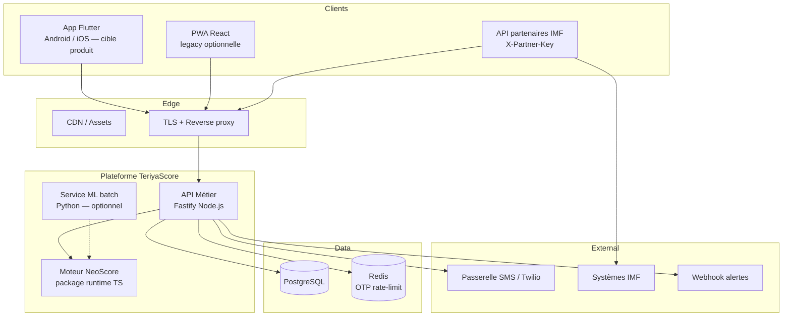
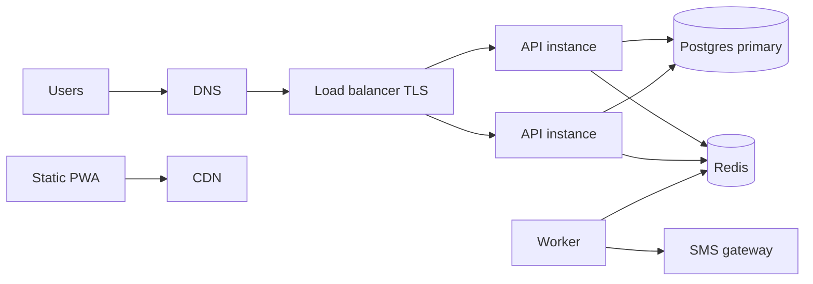

# TeriyaScore — Architecture logicielle complète

| | |
|---|---|
| **Document** | Architecture logicielle (Software Architecture Document) |
| **Rôle** | Software Architect |
| **Sources** | UML validés (`docs/uml/`), `domain-model.md`, `analysis-report.md` |
| **Périmètre** | Conception — **aucun code** |
| **Version** | 1.0 |
| **Date** | Juillet 2026 |

---

## 1. Objectifs d’architecture

L’architecture doit servir le positionnement TeriyaScore : **tiers de confiance** entre travailleur informel et IMF.

| Objectif | Implication architecturale |
|----------|----------------------------|
| Offline-first (cahier quotidien) | Client capable de saisir sans réseau + sync idempotente |
| MFA (OTP + PIN) | Séparation défis OTP, secrets, sessions |
| NeoScore explicable | Moteur de scoring runtime isolé + snapshots immuables à la demande de crédit |
| Consentement avant partage IMF | Gate obligatoire côté API / domaine |
| Pilote 50–100 → milliers d’utilisateurs | Modularité, Postgres dès la cible, scaling horizontal API |
| Équipe réduite | Stack maîtrisée, monorepo, peu de services critiques au MVP |

---

## 2. Vue d’ensemble (C4 — conteneurs)



> **Cible produit :** application **Flutter** (`apps/mobile`). La PWA (`apps/web`) est conservée en legacy uniquement.

### Choix global : monolithe modulaire + 1 worker

| Option | Décision | Pourquoi |
|--------|----------|----------|
| Microservices dès le jour 1 | **Non** | Équipe petite, pilote local, complexité ops injustifiée |
| Monolithe modulaire API | **Oui** | Bounded contexts clairs (auth, cahier, score, crédit, sync, IMF) dans un seul déploiement |
| Worker séparé | **Oui (cible)** | SMS / retries / jobs hors chemin HTTP critique |
| ML en ligne synchrone | **Non** | Score runtime déterministe ; ML = batch de recalibrage |

---

## 3. Architecture backend

### 3.1 Style

**API hexagonale / clean légère** par module :

```text
adapters/http  →  application (use cases)  →  domain  →  adapters/persistence | messaging | sms
```

Aligné UML :

- **Domain** : entités du class diagram (`TravailleurInformel`, `Operation`, `NeoScore`, `DemandeCredit`…)
- **Application** : `DefiOTP`, `SessionAuthentifiee`, orchestration MFA, sync, soumission crédit
- **Adapters** : HTTP, PostgreSQL, Redis, SMS

### 3.2 Modules (bounded contexts)

| Module | Responsabilité | UC / agrégats |
|--------|----------------|---------------|
| `identity` | Compte, MFA, session, statuts compte | UC01–UC04b |
| `profile` | Profil activité, préférences | UC05–UC06 |
| `consent` | Consentements, vérification, révocation | UC07, UC07v, UC07r |
| `ledger` (cahier) | Opérations, clients informels, règlement créances | UC08–UC12, UC11b |
| `sync` | File hors-ligne, idempotence, accept/reject | UC13 |
| `scoring` | Calcul NeoScore, critères, historique, offre | UC14–UC15 |
| `credit` | Demandes, snapshots, orientation IMF | UC16–UC17, UC19 |
| `partners` | IMF, accès profils, commissions | UC18–UC19 |
| `field` | Agents terrain (phase 2) | UC20 |

### 3.3 Stack backend recommandée

| Composant | Choix | Justification |
|-----------|-------|---------------|
| Runtime | **Node.js LTS (≥ 20)** | Écosystème TypeScript unifié avec le frontend ; I/O réseau adapté |
| Framework HTTP | **Fastify** | Performances, schéma de validation, plugins, faible overhead |
| Langage | **TypeScript strict** | Contrats partagés avec le client ; typage des règles métier |
| Validation entrée | **Zod** (ou JSON Schema Fastify) | Alignement avec contrats `shared` |
| ORM / accès données | **Prisma** (ou Drizzle) sur **PostgreSQL** | Productivité + migrations ; rester indépendant du SQL métier |
| Score runtime | **Package `@teriyascore/neoscore` (TS)** | Déterministe, testable, déployé avec l’API |
| ML batch | **Python + scikit-learn** (service optionnel) | Déjà présent dans les livrables ; pas sur le chemin critique HTTP |
| Jobs | **Worker Node** + file Redis (BullMQ) | Retries SMS, purge OTP, traitements différés |
| Logs | Structured JSON (pino) | Observabilité |
| Config | Variables d’environnement + secrets manager (prod) | 12-factor |

### 3.4 Flux backend critiques

**MFA (séquence UML)**  
`initierLogin` → contrôle statut compte → `DefiOTP` → SMS → validation/consommation OTP → vérification PIN + compteur → `SessionAuthentifiee`.

**Sync cahier**  
Client envoie mutations `{ identifiantLocal, payload }` → contrôle d’idempotence → création `Operation` → marquage `OperationHorsLigne.acceptee`.

**Crédit**  
`peutDemanderCredit` ∧ offre valide ∧ `VérifierConsentementPartage` → `DemandeCredit` + `SnapshotScore` immuable → statut `soumise`.

### 3.5 Ce que le backend ne fait pas (volontairement)

- Ne remplace pas le cœur décisionnel IMF (TeriyaScore oriente / score).
- Ne stocke pas le PIN en clair.
- Ne calcule pas le score via un appel ML synchrone opaque.

---

## 4. Architecture frontend

### 4.1 Stratégie client

| Phase | Choix | Pourquoi |
|-------|-------|----------|
| MVP / pilote | **PWA React (Vite)** | Déploiement rapide, installable sur Android, offline via Service Worker, un seul codebase web |
| Cible moyen terme | **Expo React Native** (réemploi des contrats `shared`) | Meilleure UX native, push, stockage sécurisé — sans jeter le domaine |

**Choix MVP : PWA** — contrainte terrain (connectivité) et budget ; la PWA couvre UC cahier + MFA + score sans stores.

### 4.2 Organisation frontend

Architecture **feature-first** alignée sur les packages UC :

```text
features/
  auth/          MFA, session
  onboarding/    profil
  consent/
  ledger/        ventes, stock, dépenses, créances
  sync/
  score/
  credit/
  dashboard/
shared/
  ui/            design system TeriyaScore (teal)
  lib/           api client, storage, i18n
app/             routing, guards (auth, onboarding)
```

### 4.3 Capacités offline

| Couche | Rôle |
|--------|------|
| UI | Saisie vente/stock/créance sans réseau |
| Store local | Queue `OperationHorsLigne` (IndexedDB préférable à localStorage dès que volume ↑) |
| Sync engine | Déclenche UC13 à `online` / manuel ; respecte `identifiantLocal` |
| Cache lecture | Dernier dashboard / score en cache stale-while-revalidate |

**Choix IndexedDB (cible)** vs localStorage : quotas, indexation, fiabilité pour file de sync.

### 4.4 Stack frontend

| Élément | Choix | Justification |
|---------|-------|---------------|
| UI | React 19 + TypeScript | Composants, écosystème, équipe |
| Build | Vite | DX, PWA plugin |
| Routing | React Router | Guards auth / onboarding |
| État serveur | Fetch + cache léger (TanStack Query recommandé) | Sync, invalidation dashboard/score |
| État offline | Module sync dédié | Séparation claire UC13 |
| Styles | Design tokens TeriyaScore (CSS variables) | Cohérence maquette / Figma |
| i18n | Dictionnaires FR d’abord ; structure prête MR/DL/FF | Roadmap accessibilité |
| PWA | Workbox / vite-plugin-pwa | App shell + runtime caching API en NetworkFirst |

### 4.5 Portail IMF (phase 2)

Application web séparée (même monorepo `apps/partners`) :

- Auth partenaire (client credentials ou comptes IMF)
- Consultation profils scorés **uniquement** si consentement
- File de demandes crédit
- Pas d’accès aux secrets travailleur (RM-AT01 analogique)

---

## 5. Architecture base de données

### 5.1 Choix du SGBD

| Environnement | SGBD | Pourquoi |
|---------------|------|----------|
| Dev local rapide | SQLite possible | Prototypage |
| **Cible pilote / prod** | **PostgreSQL 16+** | Intégrité, contraintes, JSON pour payloads sync, scalabilité, backups, rôles |

**Pourquoi Postgres plutôt que rester SQLite** : multi-écritures, partenaires IMF, audit, contraintes d’unicité fortes (`telephone`, `identifiantLocal`, `reference` demande).

### 5.2 Principes de mapping (logique — pas de DDL ici)

Le schéma logique suit le **class diagram corrigé**, sans héritage table-per-type pour `Operation` (HER-01b) :

| Concept domaine | Table logique | Notes |
|-----------------|---------------|-------|
| TravailleurInformel | `travailleurs` | `telephone` UNIQUE ; `pin_hash` ; statut |
| ProfilActivite | `profils_activite` | 1—0..1 |
| PreferencesUtilisateur | `preferences` | 1—0..1 |
| Consentement | `consentements` | UNIQUE (`travailleur_id`, `type`) |
| ClientInformel | `clients_informels` | FK travailleur |
| Operation | `operations` | check constraints selon `type` |
| OperationHorsLigne | `operations_hors_ligne` | `identifiant_local` UNIQUE ; état |
| NeoScore | `neoscores` ou vue matérialisée + historique | score courant |
| HistoriqueScore | `neoscore_historique` | |
| OffreCredit | `offres_credit` | N offres dans le temps |
| DemandeCredit | `demandes_credit` | `reference` UNIQUE |
| SnapshotScore | colonnes immuables **ou** table `snapshots_score` | figé à soumission |
| InstitutionMicrofinance | `imf` | |
| AccesProfilImf | `acces_profils_imf` | audit |
| Commission | `commissions` | 0..1 par demande décaissée |
| DefiOTP | Redis (TTL) **prioritaire** ; PG optionnel audit | expiration naturelle |
| Session | Redis + liste de révocation / PG sessions | TTL |

### 5.3 Redis

| Usage | Justification |
|-------|----------------|
| Défis OTP + TTL | Expiration automatique, faible latence |
| Rate limiting MFA | Anti-bruteforce PIN / renvoi OTP |
| Sessions / blacklist jetons | Révocation rapide |
| Files de jobs | Worker SMS |

### 5.4 Règles d’intégrité à imposer côté données

- `operations.montant_fcfa > 0`
- Si `type = creance` ⇒ `client_id NOT NULL` et `statut_creance NOT NULL`
- Si `type = stock` ⇒ `nature_stock NOT NULL`
- `consentements` unique par couple travailleur/type
- `operations_hors_ligne.identifiant_local` unique globalement (ou par travailleur — **recommandation : unique global UUID**)
- Demande soumise ⇒ offre_id NOT NULL + snapshot score NOT NULL

### 5.5 Stratégie migrations & environnements

- Migrations versionnées (Prisma Migrate / Flyway-equivalent)
- Seeds pilote (agents, IMF prospect)
- Backups quotidiens Postgres + PITR en prod
- Pas de données de prod sur les postes dev

---

## 6. Architecture API

### 6.1 Style

**API HTTP REST JSON**, versionnée, orientée ressources / cas d’utilisation.

| Choix | Alternative écartée | Pourquoi REST |
|-------|---------------------|---------------|
| REST + JSON | GraphQL | Surface simple, cache HTTP, clients PWA/IMF hétérogènes |
| Version URI `/v1` | Header only | Clarté pour partenaires IMF |

### 6.2 Frontière API

```text
HTTPS
  └─ /v1
       /auth/...
       /me/...
       /operations/...
       /sync/...
       /score/...
       /credit/...
       /partners/...   (API IMF, phase 2)
```

### 6.3 Groupes d’endpoints (conception)

| Groupe | Exemples de capacités | Auth |
|--------|----------------------|------|
| Auth | request OTP, verify OTP, login PIN, logout, refresh | Public / session |
| Me / profil | GET/PATCH profil, préférences, consentements | Bearer travailleur |
| Operations | CRUD métier restreint, régler créance | Bearer |
| Dashboard | agrégats CA, créances, dernières ops | Bearer |
| Sync | `POST /sync/push`, `GET /sync/pull` | Bearer |
| Score | GET NeoScore, détail critères | Bearer |
| Credit | GET offre, POST demande, GET statut | Bearer |
| Partners | GET profil consenti, liste demandes | Auth IMF |

### 6.4 Contrats

- Schémas d’entrée/sortie partagés (`packages/shared`)
- Erreurs normalisées : `{ error, message, details? }`
- Idempotency-Key sur sync = `identifiantLocal`
- Pagination cursor sur listes opérations / accès IMF

### 6.5 Sync API (point sensible)

```text
POST /v1/sync/push
Body: { mutations: [ { identifiantLocal, kind, payload, dateSaisieLocale } ] }
→ { accepted[], rejected[{ id, reason }], serverTime }
```

Garanties :

- Au plus une `Operation` acceptée par `identifiantLocal` (RM-OL03)
- Réponses rejouables (même résultat si retry)

### 6.6 Documentation

OpenAPI 3 générée / maintenue ; portail lecture pour IMF en phase partenariat.

---

## 7. Architecture sécurité

### 7.1 Modèle de menaces (abrégé)

| Menace | Mesure |
|--------|--------|
| Vol de session | JWT court + refresh / TTL Redis ; HTTPS only |
| Bruteforce PIN | Compteur + verrouillage temporaire (UML MFA) |
| Rejeu OTP | Consommation one-shot + TTL |
| Enumération comptes | Messages d’erreur non discriminants en prod (option) |
| Partage abusif profils IMF | Gate consentement + audit `AccesProfilImf` |
| Fuite PIN | Hash adaptatif (Argon2id / bcrypt cost élevé) |
| Injection / XSS | Validation Zod, CSP PWA, sanitization |
| Accès agent au secret | RM-AT01 : aucun endpoint agent vers PIN |

### 7.2 Authentification travailleur (MFA)

Conforme diagrammes séquence/activité :

1. Possession : OTP SMS via passerelle
2. Connaissance : PIN
3. Session : jeton opaque ou JWT signé (recommandation : **access JWT 15–60 min** + refresh rotatif stocké Redis)

Statuts compte : `brouillon` / `suspendu` refusent le login MFA.

### 7.3 Autorisation

| Sujet | Mécanisme |
|-------|-----------|
| Travailleur | JWT `sub = travailleurId` ; isolation stricte des données |
| IMF | Client OAuth2 / API keys signées + scopes (`profiles:read`, `applications:write`) |
| Agent terrain | Rôle limité onboarding ; **pas** de lecture PIN / OTP |

Policy engine simple (middleware) : `requireConsent('partage_imf')` avant tout accès partenaire.

### 7.4 Protection des données

- Chiffrement en transit : TLS 1.2+
- Chiffrement au repos : disques Postgres managés
- Minimisation : anonymisation si consentement l’exige
- Journalisation des accès IMF (immuable append-only logique)
- Secrets : jamais en repo ; vault / secret manager en prod

### 7.5 Rate limiting & abus

- Par IP + par téléphone sur OTP
- Par compte sur PIN
- Quotas API IMF

### 7.6 Conformité / confiance

- Consentements versionnés (`versionPolitique`)
- Traçabilité révocation (bloque **nouveaux** accès)
- Politique de rétention OTP (secondes/minutes, pas jours)

---

## 8. Architecture déploiement

### 8.1 Environnements

| Env | Rôle |
|-----|------|
| `local` | Dev ; Docker Compose (API, Postgres, Redis, Mail/SMS mock) |
| `staging` | Recette pilote ; SMS sandbox |
| `production` | Ouagadougou pilote puis montée en charge |

### 8.2 Topologie cible pilote



### 8.3 Choix d’hébergement (recommandation)

| Couche | Option réaliste Burkina / Afrique de l’Ouest | Pourquoi |
|--------|-----------------------------------------------|----------|
| Compute API | Conteneurs (Fly.io, Render, AWS ECS, ou VPS Docker) | Simplicité ops équipe réduite |
| Postgres | Managed (Supabase, Neon, RDS, ou managed local cloud) | Backups, HA |
| Redis | Managed | TTL OTP fiable |
| PWA | CDN (Cloudflare Pages / Netlify / S3+CDN) | Latence assets |
| SMS | Agrégateur régional (Orange, Twilio, Africa’s Talking…) | OTP réel |

**Décision** : commencer **conteneurs + Postgres/Redis managés** ; éviter Kubernetes au MVP.

### 8.4 CI/CD (conception)

```text
PR → lint + tests unitaires domaine/score + build
main → image API + publish PWA staging
tag release → prod (migration DB puis rolling API)
```

Gates : migrations backward-compatible ; feature flags pour IMF.

### 8.5 Observabilité

- Métriques : latence API, taux échec OTP/SMS, profondeur file sync, erreurs 4xx/5xx
- Tracing : request-id de bout en bout
- Alertes : SMS provider down, taux PIN lock, erreur sync > seuil

### 8.6 Stratégie de release produit

| Jalon | Contenu déploiement |
|-------|---------------------|
| MVP pilote | PWA + API + Postgres + Redis + SMS sandbox/prod limité + score TS |
| Pilote IMF | API partners + audit accès + staging dédié |
| Scale | 2+ instances API, replicas read Postgres si besoin, CDN régional |
| Mobile native | Expo partageant `shared` + `neoscore` |

---

## 9. Découpage monorepo cible (organisation)

```text
teriyascore/
  apps/
    web/           PWA travailleur
    partners/      Portail IMF (phase 2)
    api/           Fastify monolithe modulaire
    worker/        Jobs async
  packages/
    shared/        Contrats Zod / types
    neoscore/      Moteur score runtime
    domain/        (option) règles pures testables
  services/
    neoscore-ml/   Batch Python
  docs/            analyse, domaine, UML, architecture
  infra/           compose, terraform/pulumi (plus tard)
```

---

## 10. Matrice exigences → composants

| Exigence clé | Composant |
|--------------|-----------|
| EF-AUTH MFA | identity + Redis OTP + SMS + session |
| EF-OPS offline | PWA queue + sync module + PG unicité |
| EF-SCR NeoScore | package neoscore + API score |
| EF-CRD + consentement | credit + consent gate + snapshot |
| EF-CRD IMF | partners API + AccesProfilImf |
| ENF-AVL offline | Service Worker + IndexedDB + retries |
| ENF-SEC | TLS, hash PIN, rate limit, audit |

---

## 11. Risques d’architecture & mitigations

| Risque | Mitigation |
|--------|------------|
| Sur-ingénierie microservices | Monolithe modulaire jusqu’à douleur réelle |
| Score non fiable | Seuil prudent ; recalibrage ML offline ; snapshot auditable |
| Dépendance SMS | Provider secondaire ; mode secours (délai / support terrain) |
| Conflits sync | UUID idempotents ; horodatage serveur ; politiques reject claires |
| Fuite de confiance usagers | Minimisation données IMF ; UX consentement claire |

---

## 12. Feuille de route architecture

| Phase | Livrable architectural |
|-------|------------------------|
| **P0 — Fondations** | Modules API, Postgres, Redis, MFA complète, sync idempotente, PWA offline |
| **P1 — Pilote métier** | NeoScore + offres + demandes + consentements + dashboard |
| **P2 — Partenaires** | API IMF, audit accès, portail léger, commissions |
| **P3 — Scale & native** | HA, observabilité avancée, Expo, ML export (ONNX) si besoin |

---

## 13. Décisions d’architecture (ADR résumé)

| ID | Décision | Statut |
|----|----------|--------|
| ADR-001 | Monolithe modulaire Fastify plutôt que microservices | Accepté |
| ADR-002 | PWA offline-first pour MVP | Accepté |
| ADR-003 | PostgreSQL cible ; Redis pour OTP/sessions/jobs | Accepté |
| ADR-004 | NeoScore runtime TypeScript ; ML Python en batch | Accepté |
| ADR-005 | REST `/v1` + contrats partagés Zod | Accepté |
| ADR-006 | MFA OTP+PIN obligatoire pour session | Accepté |
| ADR-007 | Pas d’héritage DB pour Operation (HER-01b) | Accepté |
| ADR-008 | SnapshotScore immuable à la soumission crédit | Accepté |
| ADR-009 | Conteneurs + services managés ; pas de K8s au MVP | Accepté |

---

## 14. Conclusion

L’architecture proposée est une **plateforme FinTech d’inclusion** pragmatique :

- **Backend** modulaire, testable, aligné UML  
- **Frontend** PWA offline-first, prêt pour native  
- **Données** Postgres + Redis, contraintes du domaine  
- **API** REST versionnée, sync idempotente, API IMF séparée  
- **Sécurité** centrée MFA, consentement, audit  
- **Déploiement** simple, observable, évolutif  

Elle reste **indépendante du code existant** : le dépôt actuel peut s’y conformer progressivement, mais ce document fixe la **cible de conception** avant toute nouvelle génération de code.

---

## Annexe — Relation avec `architecture.md`

Le fichier `docs/architecture.md` décrit l’esquisse initiale du dépôt.  
**Le présent document** (`software-architecture.md`) est la **référence d’architecture complète** post-UML.
